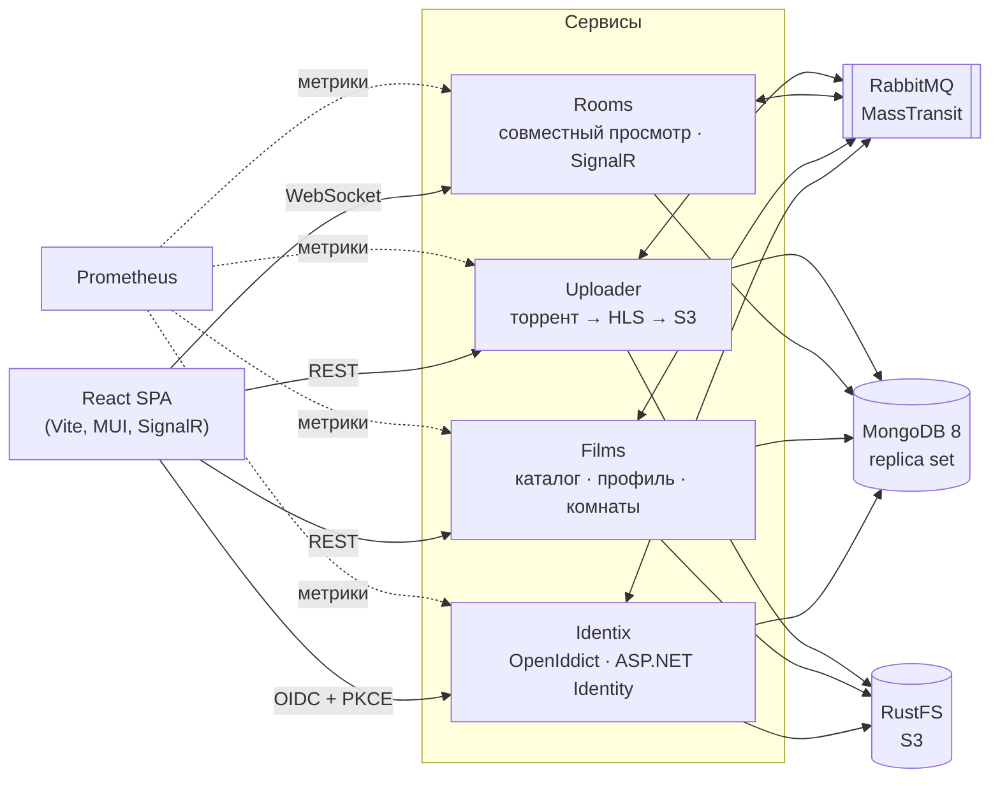

<div align="center">

# 🎬 Overoom

**Платформа для совместного просмотра фильмов и сериалов**

Каталог с подборками и рейтингами, комнаты, где друзья смотрят кино синхронно и переписываются в чате, собственный сервер авторизации и конвейер, который превращает торрент в адаптивный HLS-поток.


</div>

---

## Что это такое

Overoom — это не «сайт с плеером», а распределённая система из нескольких сервисов, каждый со своей областью ответственности, своей базой и своими доменными правилами. Сервисы общаются через шину сообщений, фронтенд работает в реальном времени через SignalR, а видео готовится в фоне: от magnet-ссылки до многобитрейтного потока в объектном хранилище.

Весь проект — от доменной модели до nginx-конфига и от ORM до кнопки реакции в чате — спроектирован и написан одним человеком.

<table>
<tr>
<td width="50%" valign="top">

### 🎞 Каталог
Поиск по названию, жанрам, странам, людям и годам. Подборки, популярное, пользовательские оценки со статистикой, комментарии с реакциями, «Смотреть позже» и история просмотров.

</td>
<td width="50%" valign="top">

### 🍿 Комнаты
Совместный просмотр с синхронизацией плеера по владельцу комнаты, чат с реакциями и индикатором «печатает», статусы зрителей, «разбудить» и «напугать», приватные комнаты по коду.

</td>
</tr>
<tr>
<td width="50%" valign="top">

### 🔐 Identix
Собственный OpenID Connect сервер: регистрация с подтверждением почты, восстановление пароля, двухфакторная аутентификация, вход через Google, GitHub, Microsoft, Discord, Яндекс и VK ID.

</td>
<td width="50%" valign="top">

### 📦 Uploader
Фоновые задачи загрузки: торрент через DHT, транскодирование ffmpeg с аппаратным кодированием NVENC в HLS от 360p до 4K, загрузка в S3 и админка задач с отменой, повтором и прогрессом по этапам.

</td>
</tr>
</table>

---

## Архитектура



Каждый бизнес-сервис устроен по принципам **Clean Architecture** и **DDD**. Зависимости направлены строго внутрь:

```
Domain  ←  Application.Abstractions  ←  Application.Services
   ↑                                           ↑
   └──────────  Infrastructure.* (Storage, Bus, Web)  ←  Start (composition root)
```

- **Domain** — агрегаты, объекты-значения, спецификации и доменные события. Ни одной ссылки на инфраструктуру.
- **Application** — команды и запросы (CQRS на MediatR), обработчики доменных событий.
- **Infrastructure** — хранилище, шина, веб-слой. Запросы на чтение живут в Storage и читают денормализованные данные напрямую, минуя агрегаты.
- **Start** — точка сборки: DI, конфигурация, middleware.

---

## Инженерные решения

Здесь самое интересное: задачи, которые не решаются «из коробки».

### 🧬 Собственная мини-ORM для MongoDB

Официальный драйвер MongoDB не отслеживает изменения: либо заменяй документ целиком (и затирай параллельные правки), либо пиши `$set`/`$push`/`$pull` руками в каждом репозитории. Для DDD с богатыми агрегатами не подходит ни то, ни другое.

Поэтому я написал **[MongoTracker](https://github.com/lncendia/MongoTracker)** — change tracker в духе EF Core, но для документной модели:

- сравнивает снимок документа с текущим состоянием и строит **минимальный набор атомарных операторов** — `$set` только изменённых полей, `$push`/`$pull` для множеств, вложенные объекты любой глубины;
- **адресует элементы массивов по ключу**, а не по индексу: `Seasons.$[i0].Episodes.$[i1].Versions` через `arrayFilters`. Параллельное удаление одного зрителя больше не сдвигает индексы и не отправляет изменение другому;
- **оптимистичная конкуренция** через версии и concurrency-токены, с понятным `MongoConcurrencyException`;
- изменения принимаются только после успешной записи, так что неудачный `BulkWrite` не теряет отслеживаемое состояние;
- покрыт тестами, включая интеграционные против настоящего MongoDB, опубликован в NuGet.

На нём же построен **[Identity.Mongo](https://github.com/lncendia/Identity.Mongo)** — хранилище ASP.NET Core Identity для MongoDB, на котором работает Identix.

### 🔄 Надёжная доставка событий: outbox и inbox

Сервисы обмениваются интеграционными событиями через MassTransit с **transactional outbox** и **inbox** в MongoDB: событие фиксируется в той же транзакции, что и изменение агрегата, а повторная доставка отсекается без побочных эффектов.

Граница транзакции задаётся **на точке входа** — атрибутом `[Transactional]` на действии контроллера или inbox консьюмера, а не внутри обработчиков. Unit of Work подхватывает текущую транзакцию, а если её открыл сам outbox при публикации, фиксирует её вместе с изменениями. Ни одно событие не теряется молча.

### ⚡️ Доменные события с фазами

Доменные события разделены на две фазы:

- **до сохранения** — в той же транзакции: проверка инвариантов, публикация интеграционных событий, денормализация через атомарный `$inc`;
- **после сохранения** — после фиксации транзакции: уведомления в SignalR, которые не должны уходить, если запись откатилась.

### 🧮 Денормализация вместо JOIN

MongoDB не любит `$lookup`, поэтому данные для чтения готовятся заранее:

- средний рейтинг и число оценок фильма;
- жанровые предпочтения пользователя;
- счётчики реакций на комментарии.

Всё обновляется атомарными `$inc` в обработчиках событий, внутри транзакции. Реакция — отдельный агрегат, в документе комментария хранится только счётчик.

### 🎯 Комнаты без блокировок

Состояние плеера у десятка зрителей меняется десятки раз в минуту. Оптимистичная блокировка здесь превратилась бы в бесконечные повторы, поэтому комнаты работают на **атомарных точечных обновлениях**: каждая команда меняет одного зрителя, а зрители адресуются в массиве по идентификатору. Параллельные изменения не конфликтуют и не затирают друг друга.

### 🎥 Конвейер видео

Загрузка фильма — это долгая задача на часы, которая должна переживать перезапуски сервиса. Поэтому она построена на job-сагах MassTransit:

1. **Торрент.** MonoTorrent со своим входом в DHT: даже если трекер раздачи недоступен, пиры находятся за секунды.
2. **Транскодирование.** ffmpeg с NVENC в адаптивный HLS: несколько качеств и master-плейлист.
3. **Загрузка** в S3-совместимое хранилище RustFS.
4. **Публикация** события о готовности версии фильма.

Текущий этап и пути к файлам сохраняются в состоянии задачи, поэтому после сбоя или повтора задача продолжает с того этапа, где остановилась. Отмена честно убивает ffmpeg, а в админке видно этап, прогресс и причину ошибки.

### 📈 Наблюдаемость

OpenTelemetry во всех сервисах, метрики в Prometheus, включая собственные метрики репозиториев: длительность транзакций, время обработки доменных событий, число активных подключений к комнатам. Структурированные логи на Serilog.

---

## Технологии

| Слой | Стек |
|---|---|
| **Backend** | .NET 10, C# 14, ASP.NET Core, SignalR, MediatR, FluentValidation, AutoMapper |
| **Данные** | MongoDB 8 (replica set, транзакции), MongoTracker, Identity.Mongo |
| **Интеграция** | RabbitMQ (с delayed exchange), MassTransit: outbox, inbox, job-саги, SignalR backplane |
| **Авторизация** | OpenIddict 7: authorization code + PKCE, внешние провайдеры, 2FA |
| **Видео** | MonoTorrent, ffmpeg (NVENC), HLS, RustFS (S3) |
| **Frontend** | React 19, TypeScript, Vite 8, MUI 9, Inversify, Formik, oidc-client-ts |
| **Инфраструктура** | Docker Compose, nginx, Prometheus, OpenTelemetry, Serilog, Quartz |

**Масштаб:** 33 проекта в решении, около 38 тысяч строк C# и 16 тысяч строк TypeScript.

---

## Структура репозитория

```
├── compose.yml              # вся инфраструктура и сервисы одной командой
├── development/             # локальные конфигурации и данные контейнеров (не в git)
├── rabbitmq/                # образ RabbitMQ с плагином отложенных сообщений
├── src/
│   ├── Common.*             # общее ядро: домен, репозитории, транзакции, DI, контракты событий
│   ├── Films.*              # каталог, профиль, комнаты (доменная часть)
│   ├── Rooms.*              # совместный просмотр в реальном времени
│   ├── Identix*             # сервер авторизации и его клиентская часть
│   ├── Uploader.*           # загрузка и транскодирование видео
│   └── Overoom.React/       # SPA
└── tests/
```

---

## Запуск

Нужны Docker, .NET 10 SDK и Node.js 24. Для транскодирования в Uploader нужна видеокарта NVIDIA.

```bash
docker compose up -d
```

Поднимутся MongoDB, RabbitMQ, RustFS, Prometheus, Identix, Films и Rooms.

```bash
cd src/Overoom.React && npm install && npm run dev
```

Фронтенд откроется на `https://localhost:5173`. Сервис загрузки запускается отдельно:

```bash
dotnet run --project src/Uploader.Start
```

| Сервис | Адрес |
|---|---|
| Frontend | https://localhost:5173 |
| Identix | https://localhost |
| Films API | https://localhost:7131 |
| Rooms (SignalR) | https://localhost:7291 |
| Uploader API | https://localhost:7159 |

---

## Об авторе

<table>
<tr>
<td valign="top">

Меня зовут **Егор**, и Overoom — мой проект от первой строки до последней.

На нём видно, как я работаю:

- **Проектирую, а не просто пишу код.** Границы сервисов, агрегаты, направление зависимостей и место транзакции продуманы заранее, а не появились по ходу дела.
- **Докапываюсь до корня.** Если торрент не качается, я разбираюсь, какой DHT-узел не отвечает из этой сети. Если данные пропадают, нахожу, какая библиотека незаметно открывает транзакцию.
- **Делаю инструменты, когда их нет.** Когда драйвер MongoDB не подошёл для DDD, я написал свою ORM и довёл её до NuGet.
- **Думаю о конкурентности и надёжности.** Outbox и inbox, оптимистичные блокировки там, где они нужны, и атомарные обновления там, где блокировки мешают.
- **Закрываю весь стек.** Домен, инфраструктура, авторизация, видеоконвейер, фронтенд, деплой и метрики.

</td>
</tr>
</table>

<div align="center">

**[GitHub](https://github.com/lncendia)** · **[MongoTracker](https://github.com/lncendia/MongoTracker)** · **[Identity.Mongo](https://github.com/lncendia/Identity.Mongo)**

*Спасибо клоду за написание README :) Если проект показался интересным — поставь ⭐*

</div>
